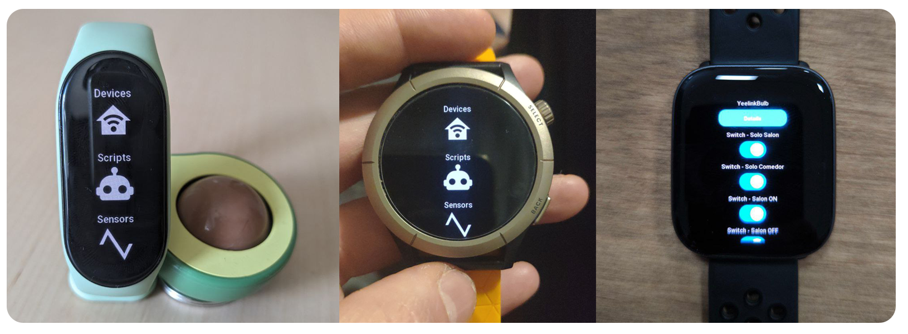

# Home Assistant companion for Zepp OS devices
This application allows you to control your Home Assistant devices from your Zepp Watch!

### ⌚ Devices supported
- Xoami Band 7
- Amazfit GTR 3 Pro
- Amazfit Cheetah Pro
- Amazfit Active

We are making changes in order to suppport more Zepp devices, if you have one ask for it in our [telegram community](https://t.me/aguacatec_es) 💬

### 📦 Installation guide
#### ⚠️ If you have a Xiaomi Band 7!!
You need to do some steps before, in order to connect it to the official Zepp App. I highly recommend you to follow [this guide](https://aguacatec.es/instalar-ha-en-la-xiaomi-band-7/).
In short, you need to modify the QR code of the bracelet to be able to link it with the application. In the aforementioned guide I show you how to do it easily.

#### 🪄 General steps
🥑 Again, i highly recommend you to follow this guide, since all the steps are more detailed and it is more difficult to get lost! Anyway, if you are an advanced user, just follow this steps:
- Download and install the official Zepp App for [Android](https://play.google.com/store/apps/details?id=com.huami.watch.hmwatchmanager) or [iOS](https://apps.apple.com/es/app/zepp-formerly-amazfit/id1127269366).
- Enable [Developer Mode](https://docs.zepp.com/docs/1.0/guides/tools/zepp-app/) in Zepp App. 
- Build and install the ha-zepp application yourself using the [Zeus CLI](https://docs.zepp.com/docs/1.0/guides/tools/cli/)
- Open the application settings and specify the addresses of Home Assistant, Long-lived access token and select the entities you want to display on Zepp OS device

### ♥️ Support us!

